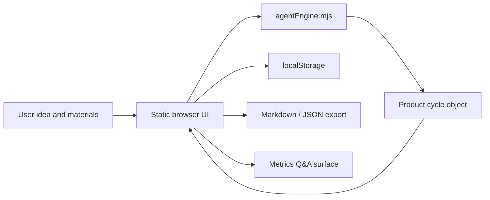
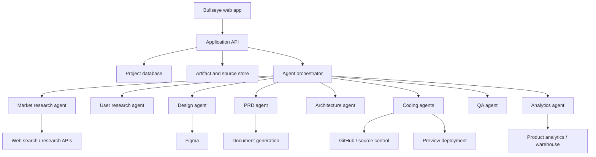

# Bullseye Architecture

Bullseye is currently implemented as a self-contained static web app. The architecture separates product-cycle generation from browser rendering so the agent logic can be tested independently and later replaced with live services.

## Current Architecture



## Runtime Components

### Static Shell

`index.html` defines the application layout:

- Left intake rail
- Main artifact workspace
- Stage navigation
- Lifecycle map
- Right governance and analytics rail
- Reusable artifact-section template

It loads `src/app.mjs` as an ES module and `src/styles.css` for styling.

### UI Controller

`src/app.mjs` owns browser-side behavior:

- Reads intake form values
- Calls the product-cycle engine
- Stores state in `localStorage`
- Renders stage tabs
- Renders artifacts
- Renders decision gates
- Records follow-up prompts
- Handles Markdown and JSON exports
- Handles the metrics Q&A interaction

The UI state shape is:

```js
{
  cycle: ProductCycle | null,
  activeStage: string
}
```

### Product-Cycle Engine

`src/agentEngine.mjs` owns the core agent logic.

Primary exports:

- `stages`
- `createProductCycle(input)`
- `applyFollowUp(cycle, stageId, prompt)`
- `setGateStatus(cycle, gateId, status)`
- `answerMetricsQuestion(cycle, metricsText, question)`
- `exportMarkdown(cycle)`

The engine is intentionally framework-free and side-effect-light. It takes plain input objects and returns plain product-cycle objects.

### Tests

`test/agentEngine.test.mjs` verifies:

- All planned stages and gates are created.
- Regulated-domain prompts trigger the compliance posture.
- Gate approvals and follow-up prompts are logged.
- Markdown export includes generated artifacts.
- Metrics Q&A references the analytics plan.

## Core Data Model

The generated cycle has this conceptual shape:

```js
{
  context: {
    idea,
    audience,
    businessModel,
    timeline,
    risk,
    materials,
    domain,
    regulated,
    outcome
  },
  generatedAt,
  stages: {
    brief,
    market,
    users,
    validation,
    strategy,
    mvp,
    design,
    prd,
    architecture,
    build,
    launch
  },
  gates: [
    {
      id,
      label,
      status,
      recommendation,
      risk
    }
  ],
  decisionLog: [
    {
      at,
      gate,
      decision,
      detail
    }
  ]
}
```

Each stage artifact has:

```js
{
  title,
  sections: [
    {
      title,
      confidence,
      items
    }
  ]
}
```

This simple shape is easy to render, export, persist, and eventually store in a backend database.

## State and Persistence

The prototype persists state in `localStorage` under:

```text
one-shot-product-agent-state
```

This keeps the app usable without a backend. In a production implementation, this should move to project-based persistence with artifact versioning and an audit log.

## Export Model

Bullseye currently supports:

- Markdown export
- JSON export

Markdown is meant for human review and handoff. JSON is meant for future system handoff into document generation, design generation, coding-agent orchestration, or backend persistence.

## Current Limitations

The current implementation does not yet include:

- Live web research
- Source citations
- Real TAM/SAM/SOM calculations
- File uploads
- Figma writes
- Document generation
- Backend persistence
- Authentication
- Multi-user projects
- Coding-agent invocation
- Deployment orchestration
- Real analytics integrations

The app currently generates a structured product plan from local deterministic logic. This is useful for validating the UX and artifact model before connecting external systems.

## Target Production Architecture



## Suggested Backend Services

A production backend should provide:

- Project CRUD
- Artifact versioning
- Decision log persistence
- Uploaded material storage
- Source and citation storage
- Research job orchestration
- Long-running agent status
- Integration credentials
- Export generation
- Analytics query routing

## Suggested Database Entities

Minimum useful entities:

- `projects`
- `project_inputs`
- `artifacts`
- `artifact_versions`
- `decision_gates`
- `decision_log_entries`
- `sources`
- `uploaded_materials`
- `agent_runs`
- `agent_tasks`
- `analytics_mappings`
- `exports`

## Agent Orchestration Boundary

The current `createProductCycle` function is the natural seam for future orchestration. In production, it can become an orchestrated workflow that:

1. Normalizes input.
2. Creates a project.
3. Starts research jobs.
4. Streams partial artifacts.
5. Waits for user approval gates.
6. Branches based on user decisions.
7. Creates design/PRD/architecture artifacts.
8. Opens coding-agent tasks only after approval.
9. Collects QA and launch-readiness results.
10. Connects analytics once the product ships.

## Integration Strategy

Recommended order:

1. Add backend persistence for projects, artifacts, and decisions.
2. Add live research with citations.
3. Add uploaded-material ingestion.
4. Add document export for PRDs and launch artifacts.
5. Add Figma or HTML prototype generation.
6. Add coding-agent task creation.
7. Add deployment preview integration.
8. Add analytics warehouse/product analytics connection.

This order keeps the core product workflow intact while replacing static pieces with live capabilities one at a time.

## Security and Privacy Considerations

Production Bullseye should account for:

- Sensitive uploaded materials
- Customer data in notes or analytics
- Redaction before model calls
- Project-level access control
- Integration secret storage
- Source provenance
- Audit logs
- Compliance review for regulated domains
- Human approval before external actions such as creating PRs, publishing designs, or launching deployments

## Development Commands

```bash
npm run dev
npm test
npm run build
```

`npm run dev` serves the static app on `http://127.0.0.1:4173/`.

`npm test` runs engine tests.

`npm run build` checks the JavaScript modules for syntax errors.
